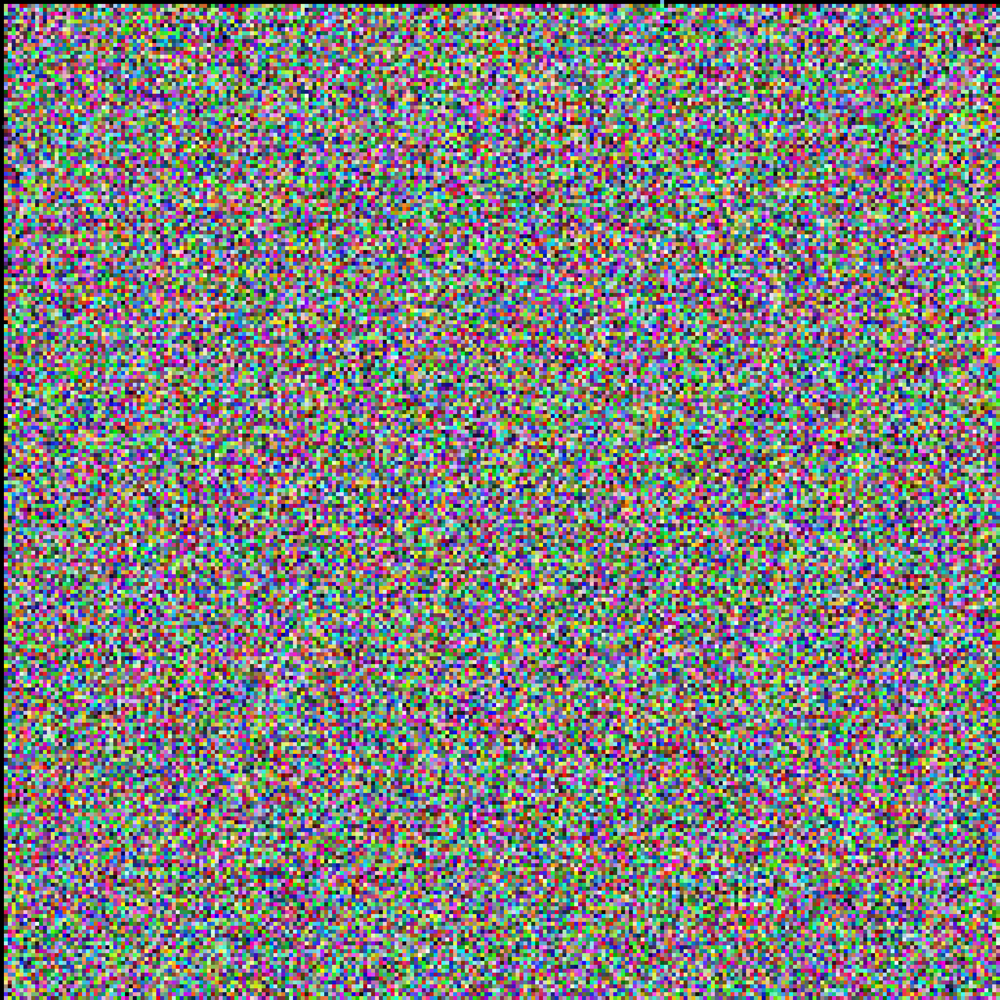

# Dots
## WebApp to Create Procedurally Generated Images
### By: [topher-lee.nft](https://topher-lee-nft.web.app)

[https://topherlee513.github.io/dots/](
https://topherlee513.github.io/dots/)

## How to:

Everything is setup to generate random options by default.

But... the user has the option to choose some options like:

- Collection Name
  - (Really Only Affects the Download Button and File Name for now)

- Number of Images in "Collection"
  - (Minimum of 1)

- Image Width and Height
  - (Minimum 256px & Maximum 4096px)

- Background Color

- Number of "Particles" per-Image
  - (Only Applies to "Random" Layout right now)

- Layout:
  - Random: Place particles all over the canvas, randomly
  - Rows: Align particles into rows and columns
- Particles
  - Dots: Cirles
  - Blocks: Squares

## Examples
  
| Random                        | Rows |
| ----------------------------- | ---------------------------- |
| Dots:                         | Dots:                        |
|  |  |
| Blocks:                              | Blocks:                           |
|  |  |
| Both:                                | Both:                             |
|  |  |

## About:

Written on my phone using various text editors and IDE's.

Proportions may suffer as a cause...

Merge Requests relating to scaling/proportions are appreciated :).